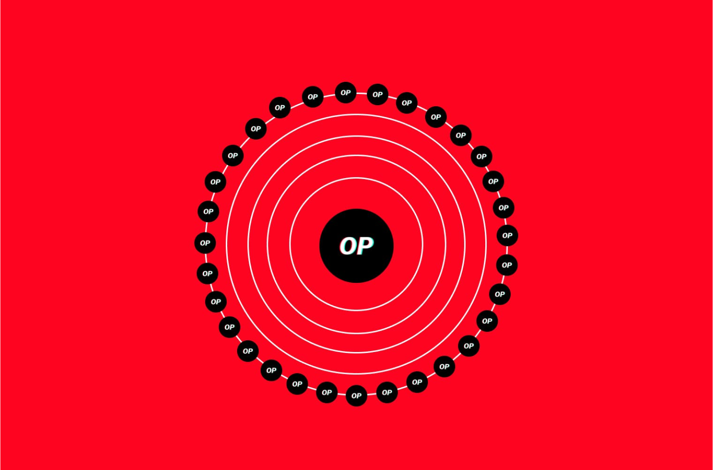
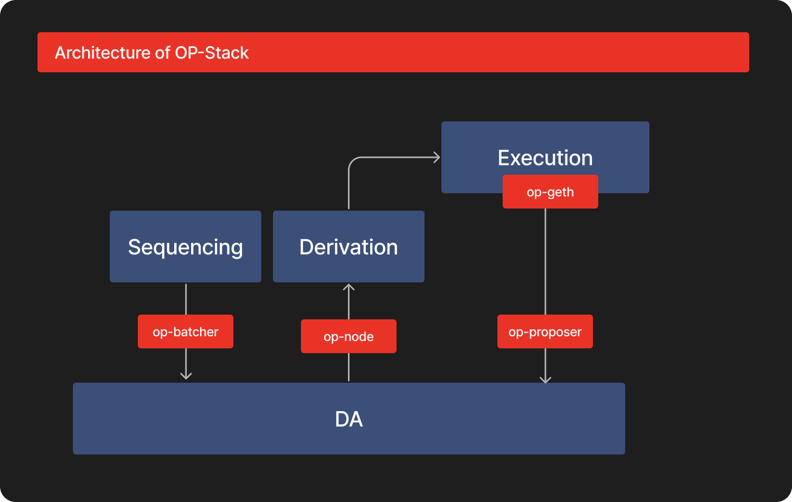
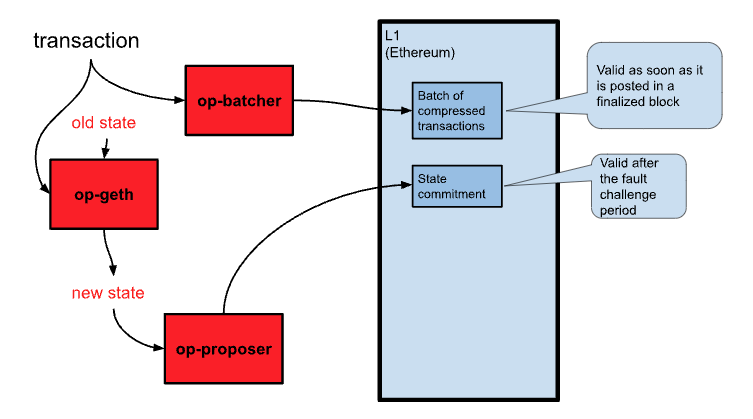

---


<details>
  <summary>Potential of OP-Stack</summary>

1. About
2. Architecture of OP-Stack
3. Transaction
4. Current Projects
5. Future Potentials


  </details>


## 1. About {#d0a1230727cf4579bfc4249946e51f46}


---


### About Optimism {#3baca44abad64987ab5d438b90611a3f}


Optimism is an open-source technology developed by OP Labs, which operates under a license-free framework. This solution has gained significant traction in the ethereum ecosystem and has been adopted by numerous projects, including Mantle, Oasys Layer 2, Metis, and Boba Network.


The codebase of Optimism has been meticulously designed for production readiness, ensuring its robustness and reliability.


### About OP-Stack {#f2494a2e8c434f5b9612eb822032e1a3}


The Optimism Stack (OP-Stack) is an open-source, modular methodology designed for constructing blockchains. This innovative approach facilitates the amalgamation of distinct proprietary components from multiple chains, yielding tailored solutions specifically for the Ethereum ecosystem. The overarching objective of OP-Stack is to establish a cohesive network of highly integrated chains that collectively constitute a Superchain.


The inaugural implementation of OP-Stack, known as Optimism Bedrock, holds considerable importance due to its capacity to empower the development of bespoke, scalable blockchain solutions. Such an approach has the potential to engender more efficient and secure decentralized applications and systems, thereby advancing the realm of blockchain technology.


## 2. Architecture of OP-Stack {#37fc457b96d3467f9a991d816fe06c60}





### 2-1. **Sequencing** {#402de5a6ed5f4cff915ee1de25c9e6ac}


The Sequencing Layer is responsible for gathering user transactions on an OP Stack chain and publishing them to the Data Availability Layer module(s) in use. In the default Rollup configuration, Sequencing is typically managed by a single Sequencer. Rules in the Derivation Layer usually restrict the Sequencer's ability to withhold transactions beyond a specific duration. In the future, Sequencing is expected to be modular, allowing chains to easily choose and modify their current Sequencer mechanism.


The default Sequencer module for OP Stack is the Single Sequencer, in which a dedicated actor is appointed as the Sequencer. The Single Sequencer module lets a governance mechanism decide who can act as the Sequencer at any given time.


### 2-2. **Data Availability** {#40ba671b55474bc387ac21263ef2c9cb}


The Data Availability Layer is crucial as it defines the sources of raw inputs for an OP Stack-based chain. OP Stack chains can utilize one or more Data Availability modules for input data. The chosen Data Availability module(s) significantly impact the security model of the system. For example, if data becomes inaccessible from the Data Availability Layer, syncing the chain may be impossible.


Ethereum DA is the most prevalent Data Availability module for OP Stack. It allows the source data to be extracted from any information accessible on the Ethereum blockchain, such as Ethereum calldata, events, and 4844 data blobs.


### 2-3. **Derivation** {#3ffb74c5256a431caf2f51e473db8a6c}


The Derivation Layer outlines how raw data in the Data Availability Layer is processed to create processed inputs sent to the Execution Layer via the standard Ethereum Engine API. The Derivation Layer can use the current system state, as defined by the Execution Layer, to inform the parsing of raw input data. It can be modified to derive Engine API inputs from various data sources and is typically closely tied to the Data Availability Layer.


The Rollup module derives Engine API inputs from Ethereum block data, Sequencer transaction batches, Deposited transaction events, and more.


### 2-4. **Execution** {#b46f109487b2440fa3cf4f173014e904}


The Execution Layer defines the state structure within an OP Stack system and the state transition function that mutates this state. State transitions are triggered when inputs are received from the Derivation Layer via the Engine API. The Execution Layer abstraction allows for EVM modifications or entirely different underlying VMs.


The EVM is an Execution Layer module that uses the same state representation and state transition function as the Ethereum Virtual Machine. The EVM module in the Ethereum Rollup configuration of OP Stack is a slightly modified version of the EVM, supporting L2 transactions initiated on Ethereum and adding an extra L1 Data Fee for each transaction to account for the cost of publishing transactions to Ethereum.


### 2-5. **Settlement Layer** {#e9076e2b998147cebb3206bfa2393bab}


The Settlement Layer is a mechanism on external blockchains that establishes a view of the state of an OP Stack chain on those external chains (including other OP Stack chains). For each OP Stack chain, there may be one or more Settlement mechanisms on one or more external chains. Settlement Layer mechanisms are read-only and allow external parties to make decisions based on the state of an OP Stack chain.


## 3. Transaction Lifecycle in OP-Stack {#62ddffee67ca47a9a4e66c5ebcf6e880}


### 3-1. Overview of a Transaction Lifecycle {#4e8dd02683654a2685ffd8c567aa9edf}





A rollup transaction process has two main requirements: (1) writing the transaction to L1 (Ethereum), typically performed by op-batcher, but any user can send an L1 transaction to submit an L2 transaction, bypassing op-batcher, and (2) executing the transaction to modify the state, which is done by op-geth, followed by op-proposer writing a commitment to the post-transaction state to L1.


To provide a more comprehensive understanding of the rollup transaction process, we can expand on the numbered steps:

1. Write the transaction to L1: `op-batcher` is responsible for writing transactions to the L1 (Ethereum) network. However, users have the flexibility to send an L1 transaction directly to submit an L2 transaction, bypassing the op-batcher. Alos, `op-batcher` compresses transactions to optimize network efficiency.
1. Monitor transaction states: Transactions go through three states - unsafe, safe, and finalized. Finalized transactions are irrevocable, while unsafe and safe transactions may be subject to changes or dropped in certain circumstances.
1. Process raw data from the Data Availability Layer: `op-node` convert it into processed inputs for the Execution Layer through the standard Ethereum Engine API. This layer can utilize the current system state, as defined by the Execution Layer, to guide the parsing of raw input data.
1. Provide transaction data to  `op-geth`: It derives inputs from Ethereum block data, Sequencer transaction batches, and Deposited transaction events. This comprehensive approach ensures that all relevant data is accurately processed and passed on to the Execution Layer, facilitating efficient and secure transactions within the network.
1. Executing the transaction: `op-geth` plays a crucial role in modifying the state according to the transaction. It is responsible for applying transactions to the previous state to generate the new state, ensuring that all transactions are accurately processed and reflected in the system. Once the state is modified, op-proposer writes a commitment to the post-transaction state to L1, ensuring the updated state is recorded.
1. State changes: `op-geth`, a slightly modified version of the standard geth, manages the storage and modification of the state throughout the transaction process, ensuring that the system accurately reflects all state changes.
1. Proposing new Merkle root: `op-proposer` proposes the new Merkle root of the state after the state has been updated. Using Merkle roots minimizes the amount of data written to L1, reducing transaction costs. The state root proposals are posted to the L2OutputOracle on the L1 network.
1. Fault challenge period: Before output proposals are considered authoritative, they must undergo a fault challenge period, which is 7 days on the production network and shorter on test networks. This period allows for potential disputes and challenges, promoting accountability and reinforcing the reliability of the network.

By following these steps, the rollup transaction process aims to streamline and optimize transactions within the network, facilitating a more efficient, reliable, and cost-effective environment for users and developers alike.


### 3-2. Sample Pseudo Code of a Transfer Transaction {#69bf6573c8b7482f89ea0e392f4c9be0}


This example illustrates a transfer transaction, where a user sends 100 ETH from their address (**`0xSenderAddress`**) to a recipient's address (**`0xRecipientAddress`**). The transaction is written to L1, monitored for state changes, and then processed through the Data Availability Layer. The **`op-geth`** derives inputs from the processed data and executes the transaction. State changes are managed, and a new Merkle root is proposed. Finally, a fault challenge period is initiated to ensure the transaction's validity.


```python
# Rollup Transaction Process

# Step 1: Write the transaction to L1
transaction_data = {
    'from': '0xSenderAddress',
    'to': '0xRecipientAddress',
    'value': 100,  # in ETH
}
op_batcher.writeTransactionToL1(transaction_data);

# Step 2: Monitor transaction states
transaction_hash = '0xTransactionHash'
transaction.monitorStates(transaction_hash);

# Step 3: Process raw data from the Data Availability Layer
raw_data = '0xRawData'
processed_data = op_node.processRawData(raw_data);

# Step 4: Provide transaction data to op-geth
op_geth.deriveInputs(processed_data);

# Step 5: Executing the transaction
old_state = '0xOldState'
new_state = op_geth.executeTransaction(transaction_data, old_state);

# Step 6: State changes
updated_state = op_geth.manageState(old_state, new_state);

# Step 7: Proposing new Merkle root
merkle_root = op_proposer.proposeNewMerkleRoot(updated_state);

# Step 8: Fault challenge period
network.initiateFaultChallengePeriod(merkle_root);
```


## 4. Potential Customization {#43797d6ea9ee4dbc869bddfc58fcd53e}


---


### 4-1. DA {#d7a5ed12f1f04a0381fd16808ec64b4b}


Alternative Data Availability (DA) Layer options include using an EVM-based blockchain other than Ethereum, implementing an "EVM-Ordered" Alternative DA module, utilizing a non-EVM DA module, or employing multiple DA modules simultaneously.


An EVM-Ordered Alternative DA module reduces costs by publishing only hashes to the EVM chain and using another data storage system for the actual data. Non-EVM DA modules involve chains not based on the EVM to manage both ordering and storage of raw input data. Multiple DA modules can be used to form a bridge between chains, requiring a global ordering between them.


All of these alternatives necessitate modifications to the derivation portion of the op-node, with non-EVM and multiple DA modules requiring significant changes. No fully-independent or multiple DA modules have been developed yet, presenting an opportunity for innovation.

- EigenDA
- CelestiaDA…

### 4-2. Sequencing {#117bd0a6796845799de8fa65e3ce08ce}


**Multiple Sequencer**


The Multiple Sequencer module is a proposed modification to the Single Sequencer module, allowing the selection of the Sequencer from a predefined set of possible actors. Individual OP Stack-based chains can determine the mechanism for defining the set of possible Sequencers and the mechanism for selecting a Sequencer from the set.


### 4-3. Derivation {#287fcb447345402a9fc8c37f4f07db85}


The Derivation Layer is highly flexible, allowing transactions to be generated from various raw input data and triggered under different conditions. The default Rollup configuration includes EVM event-triggered transactions and EVM block-triggered transactions. Custom transactions can also be created, making the Derivation Layer one of the most adaptable layers of the stack.


**Indexer**


The Indexer module is a proposed Derivation Layer module that would derive Engine API inputs when transactions are sent to, events are emitted by, or storage is modified in specific smart contracts on a Data Availability Layer module like Ethereum DA.


### 4-4. Execution {#e3c12915b46a417cb6b04ca283c13b19}


The default module is the Rollup EVM, which is a slightly modified version of the standard EVM, incorporating L1-triggered transactions and an L1 data fee. Modifications to the Execution Layer may have unintended consequences, such as breaking existing tools or opening up vulnerabilities, so it is crucial to assess each change carefully.


The default Execution Layer module can be modified in various ways, including adding precompiles or predeployed smart contracts. Precompiles can reduce the execution costs for specific use-cases. Modifications should be applied consistently to every supported execution client.


The OP Stack allows for replacing the EVM with alternative state transition functions, as long as they can be triggered via the Engine API. This flexibility has led to the implementation of an OP Stack chain running a GameBoy emulator instead of the EVM.


## 5. Current Projects {#672d999665504072b0f7fcbc0c93d6b6}


---


### 5-1. Infra {#67e37d8dd0014a1ba97e75df90ca3659}

1. **Magi: Enhancing OP-Node Client Diversity**

	Decentralization is a cornerstone of the crypto ecosystem, as networks without single points of failure offer greater security and resilience. Client diversity is vital for both Ethereum L1 and rollups, as multiple independent client implementations help ensure network safety and liveliness.


	In this context, a16z announced Magi, a Rust-based OP Stack rollup client, which aims to enhance the client diversity of `op-node`. Magi acts as the consensus client in Ethereum's traditional execution/consensus split, feeding new blocks to the execution client to advance the chain. It performs the same core functionality as the reference implementation (`op-node`) and works alongside execution nodes, such as `op-geth`, to sync with any OP Stack chain, including Optimism and Base.

1. **op-erigon**

	Op-erigon is an alternate execution client for the OP Stack, which includes Optimism's OP Mainnet and other associated chains. It was developed by Test in Prod, a team external to OP Labs. The introduction of op-erigon aims to enhance network resilience and adaptability by adding client diversity to the ecosystem, as it allows for multiple clients to coexist and function together. The first iteration of op-erigon is available on OP Goerli, a test network, and it is expected to undergo further testing and refinements before its eventual launch on OP Mainnet.


### 5-2. Application {#badcf6d65770496d9e6e7fc14b3d2c86}

1. Base by Coinbase
1. OP Clave: [https://twitter.com/doganeth_en/status/1640062610161688577?s=20](https://twitter.com/doganeth_en/status/1640062610161688577?s=20)
1. [Conduit](https://t.co/AKs1a89mfO): No-code platform for launching and managing op-chains.
1. [Restaking.wtf](https://www.notion.so/Early-Superchain-Entrants-0e2f6ee3cb6b4a79b449ca601189bb3e): Allowing op-chains to be sequenced by a decentralized operator set that stake ERC-20 tokens.
1. WorldCoin
	1. [https://worldcoin.org/blog/announcements/worldcoin-commits-optimism-superchain-vision-ahead-mainnet-launch](https://worldcoin.org/blog/announcements/worldcoin-commits-optimism-superchain-vision-ahead-mainnet-launch)

## 6. Conclusion {#c6959a0fc4d741d39d9f9615b1605fcd}


---

