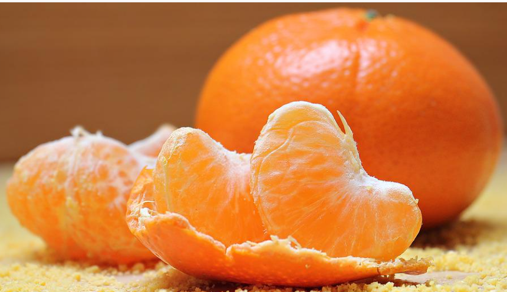

(credit: Pixabay, license: free [Pixabay license](https://pixabay.com/service/license/))

I feel like oranges are better than **[Problem Internal Link]** but less reliable.

(credit: Pixabay, license: free [Pixabay license](https://pixabay.com/service/license/))

# Heading 1 {#0390d24be99e4d28ae1b0546a0ca7736}

(credit: Pixabay, license: free [Pixabay license](https://pixabay.com/service/license/))

## Heading 2 {#d26423c865d541ac9750e12e526b1552}

(credit: Pixabay, license: free [Pixabay license](https://pixabay.com/service/license/))

### Heading 3 {#01da9879ca1b42449d846104f5fd38f1}

Normal text

